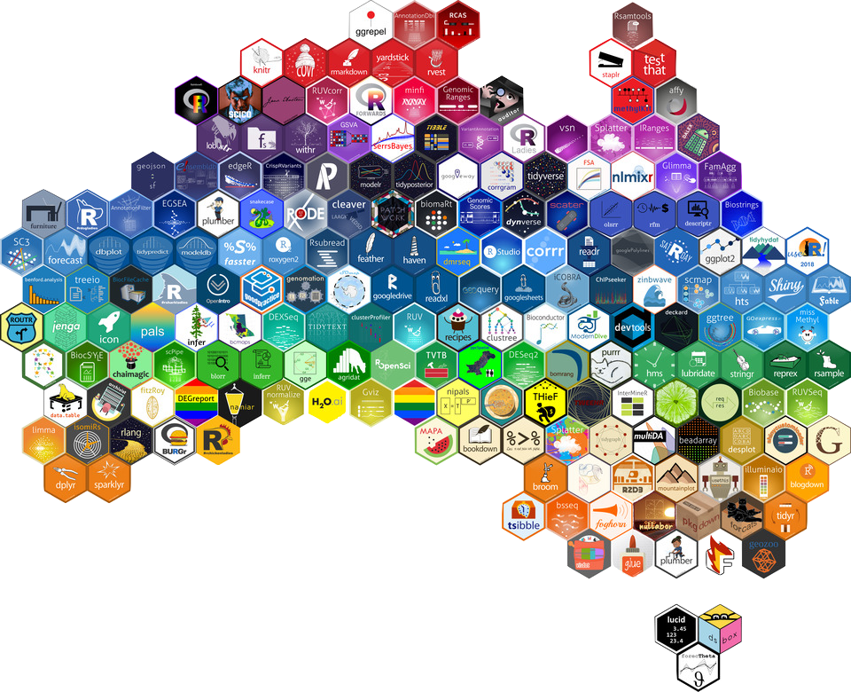

```{r packages, echo=FALSE, message=FALSE, warning=FALSE}
library(tidyverse)
library(viridis)
library(sugrrants)
library(lubridate)
```

A Quick Note 

Much of the material in the slides and in the course have been remixed and transformed from

 - https://datasciencebox.org/
 
 - https://r4ds.had.co.nz/
 
 - https://stat545.com/

---
## Course toolkit

<br>

.pull-left[
### .gray[Course operation]
.gray[
- [R4DS]()
- Zoom
- Slack
]
]
.pull-right[
### .pink[Doing data science]
- .pink[Programming:]
  - .pink[R]
  - .pink[RStudio]
  - .pink[tidyverse]
  - .pink[R Markdown]
- .gray[Version control and collaboration:]
  - .gray[Git]
  - .gray[GitHub]
]

---

## Learning goals

By the end of the course, you will be able to...

--

- automate the transformation and analysis of data

--
- automate the transformation and analysis of data, **reproducibly**

--
- automate the transformation and analysis of data, reproducibly **using modern programming tools and techniques**


--
- automate the transformation and analysis of data, reproducibly **and collaboratively**, using modern programming tools and techniques

--
- automate the transformation and analysis of data, reproducibly **(with literate programming and version control)** and collaboratively, using modern programming tools and techniques

---
class: middle

# Reproducible data analysis

---

class: middle
.pull-center[
```{r echo=FALSE}
knitr::include_graphics("img/introtodsflowchart.png")
```
]
---

## Reproducibility checklist

.question[
What does it mean for a data analysis to be "reproducible"?
]

--
- Are the tables and figures reproducible from the code and data?
- Does the code actually do what you think it does?
- In addition to what was done, is it clear *why* it was done? 

---

## Toolkit for reproducibility

- Scriptability $\rightarrow$ R = automation
- Literate programming (code, narrative, output in one place) $\rightarrow$ R Markdown or Jupyter Notebooks 
- Version control $\rightarrow$ Git / GitHub

---

## Why reproducibility

 - consistency
 - collaboration
 
---

class: middle

# R and RStudio

---

## R and RStudio

.pull-left[
```{r echo=FALSE, out.width="25%"}
knitr::include_graphics("img/r-logo.png")
```
- R is an open-source statistical **programming language**
- R is also an environment for statistical computing and graphics
- It's easily extensible with *packages*
]
.pull-right[
```{r echo=FALSE, out.width="50%"}
knitr::include_graphics("img/rstudio-logo.png")
```
- RStudio is a convenient interface for R called an **IDE** (integrated development environment), e.g. *"I write R code in the RStudio IDE"*
- RStudio is not a requirement for programming with R, but it's very commonly used by R programmers and data scientists
]

---

## Tour: R and RStudio

```{r echo=FALSE, out.width="80%"}
knitr::include_graphics("img/tour-r-rstudio.png")
```

---
## A short list (for now) of R essentials

- Functions are (most often) verbs, followed by what they will be applied to in parentheses:

```{r eval=FALSE}
do_this(to_this)
do_that(to_this, to_that, with_those)
```

--

- Packages are installed with the `install.packages` function and loaded with the `library` function, once per session:

```{r eval=FALSE}
install.packages("package_name")
library(package_name)
```

---

## R essentials (continued)

- Columns (variables) in data frames are accessed with `$`:

.small[
```{r eval=FALSE}
dataframe$var_name
```
]

--

- Object documentation can be accessed with `?`

```{r eval=FALSE}
?mean
```

---

## tidyverse

.pull-left[
```{r echo=FALSE, out.width="99%"}
knitr::include_graphics("img/tidyverse.png")
```
]

.pull-right[
.center[.large[
[tidyverse.org](https://www.tidyverse.org/)
]]

- The **tidyverse** is an opinionated collection of R packages designed for data science
- All packages share an underlying philosophy and a common grammar
]

---

## rmarkdown

.pull-left[
.center[.large[
[rmarkdown.rstudio.com](https://rmarkdown.rstudio.com/)
]]

- **rmarkdown** and the various packages that support it enable R users to write their code and prose in reproducible computational documents
- We will generally refer to R Markdown documents (with `.Rmd` extension), e.g. *"Do this in your R Markdown document"* and rarely discuss loading the rmarkdown package
]

.pull-right[
```{r echo=FALSE, out.width="60%"}
knitr::include_graphics("img/rmarkdown.png")
```
]

---

---

class: middle

# R Markdown

---


## R Markdown

- Fully reproducible reports -- each time you knit the analysis is ran from the beginning
- Simple markdown syntax for text
- Code goes in chunks, defined by three backticks, narrative goes outside of chunks

---

## Tour: R Markdown

```{r echo=FALSE, out.width="90%"}
knitr::include_graphics("img/tour-rmarkdown.png")
```

---
## R Markdown help

.pull-left[
.center[
.midi[R Markdown Cheat Sheet  
`Help -> Cheatsheets`]
]
```{r echo=FALSE, out.width="80%"}
knitr::include_graphics("img/rmd-cheatsheet.png")
```
]
.pull-right[
.center[
.midi[Markdown Quick Reference  
`Help -> Markdown Quick Reference`]
]
```{r echo=FALSE, out.width="80%"}
knitr::include_graphics("img/md-cheatsheet.png")
```
]

---

## How will we use R Markdown?

- All out of class work is an R Markdown document
- You'll always have a template R Markdown document to start with
- The amount of scaffolding in the template will decrease over the course

---

## What's with all the hexes?

```{r echo=FALSE, out.width="60%"}

```

.footnote[
Mitchell O'Hara-Wild, [useR! 2018 feature wall](https://www.mitchelloharawild.com/blog/user-2018-feature-wall/)
]

---

.your-turn[
.light-blue[.hand[Your turn:]] `AE 02 - Settlements`
- **Settlement Chaos** Markets are tanking and the traders need to know which counter parties won't be good for their money. Help them determine who they should cut ties with first. 

- Go to [RStudio Cloud](https://rstudio.cloud/) 

- Open and knit the R Markdown document `settlements.Rmd`, review the document, and fill in the blanks. We will work on this together
]
